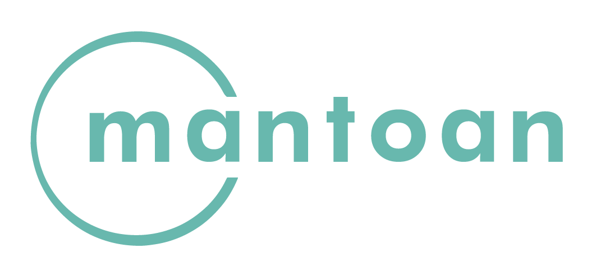
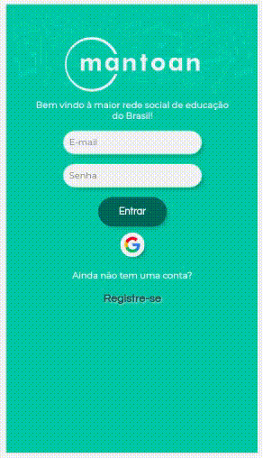
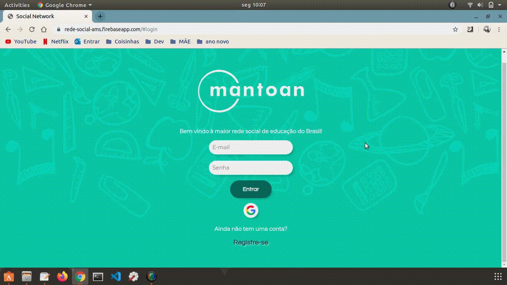
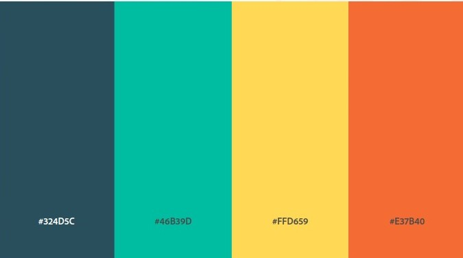

# MANTOAN

A educação inclusiva é essencial na formação e construção do caráter do indivíduo ainda na infância. As limitações que levam a adoção de políticas de educação inclusiva são basicamente de duas naturezas distintas, as limitações de aspecto físico como a cegueira, a surdez, paralisia ou ausência de membros locomotores e as limitações de aspecto cognitivo que são patologias ou síndromes que comprometem a capacidade de aprendizado do indivíduo.

Através da utilização de ferramentas e abordagens de ensino específicas é possível contornar essas limitações, possibilitando uma democratização do ensino e integração social das crianças com algum tipo de deficiência.

Por isso criamos a Mantoan, uma rede social para professores, pais e familiares de PCDs que desejam trocar experiência, atividades e encontrar maneiras de incluir e educar crianças e jovens.

O processo de inclusão está diretamente relacionado à qualificação dos professores e adaptação da infraestrutura da instituição de ensino aos equipamentos necessários para operacionalizar essa acessibilidade.

O nome Mantoan é baseado em Maria Teresa Eglér Mantoan, pedagoda, mestre e doutora em educação pela UNICAMP. Defende a educação inclusiva e ao direito incondicional de todos os alunos à educação escolar de nível básico e superior de ensino. 

## Objetivo

O objetivo deste projeto é construir uma Rede Social, Single-Page Application (SPA), responsiva na qual podemos escrever, ler, atualizar e deletar dados.

As **caraterísticas técnicas** desta aplicação:
- É uma Single-Page Application;
- É desenhada com enfoque mobile first;
- Permite a persistência de dados.

Nesta aplicação usamos *HTML5*, *CCS3*, *JavaScript (ES6+)* e *Firebase*.

### Design

* **Logotipo**
 
 Este foi o logotipo criado com o nome da Rede Social.

 

* **Tela Mobile**

* **Tela Desktop**

* **Paleta de Cores**

Esta foi a paleta de cores escolhida para utilizar na nossa aplicação.

## Histórias de Usuário

* Como usuário novo, devo poder criar uma conta com email e senha válidos para poder iniciar uma sessão e ingressar na Rede Social.

* Como usuário novo, devo poder ter a opção de iniciar sessão com minha conta do Google para ingressar na Rede Social sem necessidade de criar uma conta de email válido.

* Como usuário novo, devo poder ter a opção criar uma conta com de email e senha válidos.

* Como usuário posso visualizar uma mensagem de erro quando meu e-mail ou senha estão incorretos.

* Como usuário logado devo poder criar, guardar, modificar no mesmo lugar (in place) e deletar publicações.

* Como usuário logado devo poder ver todos os posts do mais recente para o mais antigo.

* Eu como usuário logado, posso dar like e ver a contagem de likes em minhas publicações

* Eu como usuário logado, posso escrever, salvar ou deletar um comentário em minhas publicações.